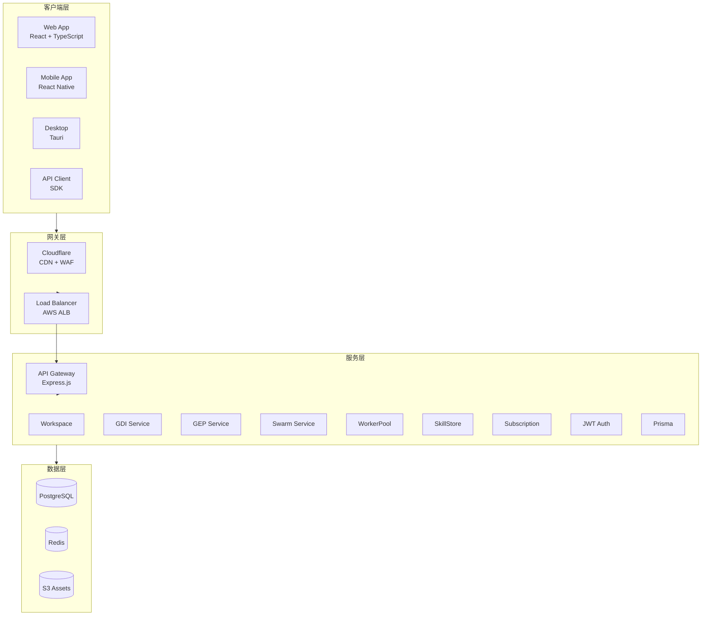
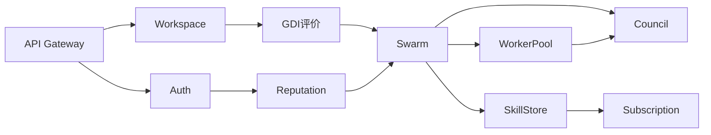
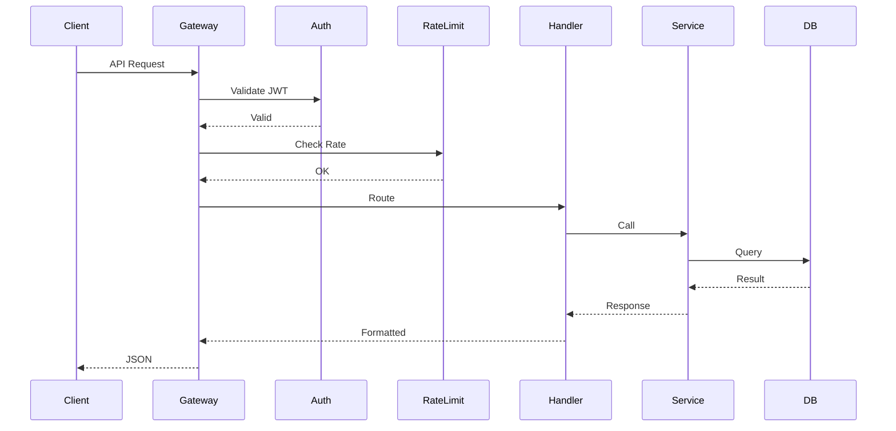
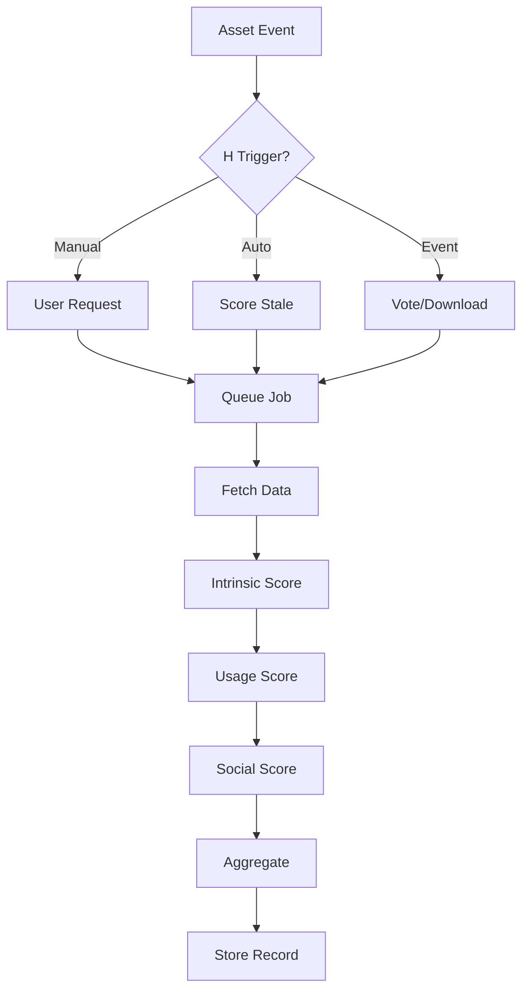

# My Evo 系统架构图 v2.0

> **版本**: 2.0 | **更新日期**: 2026-04-28

本文档使用 Mermaid 图表展示系统架构。

---

## 1. 系统整体架构

---

## 2. 模块依赖关系

---

## 3. API 请求流程

---

## 4. GDI 评分流程

---

*文档版本: v2.0 | 最后更新: 2026-04-28*
