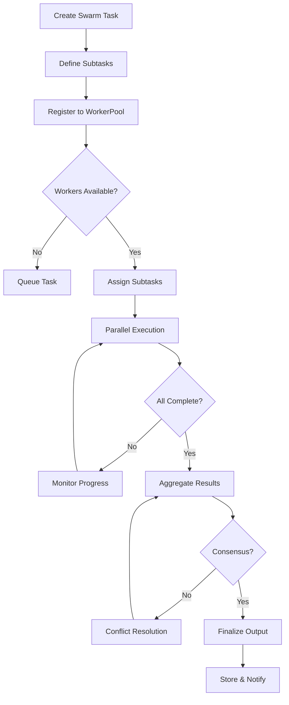
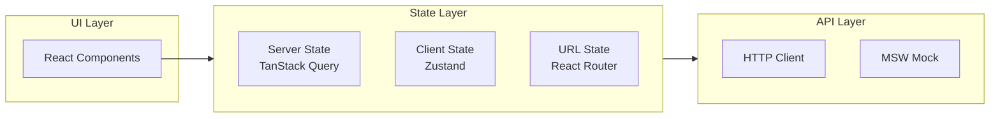
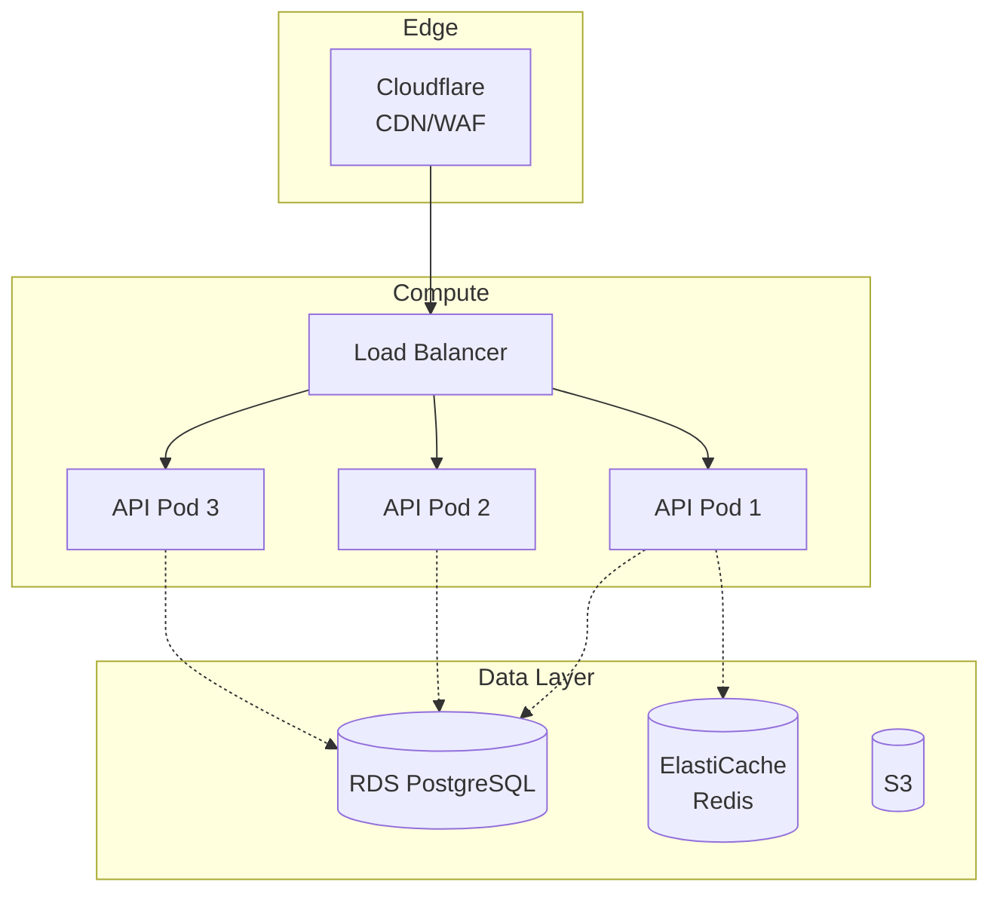
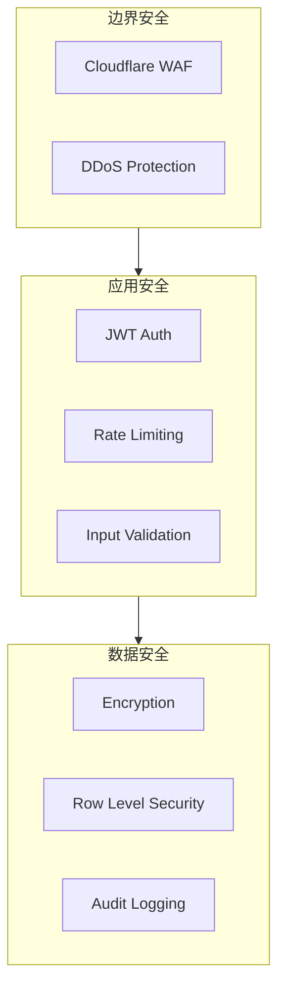
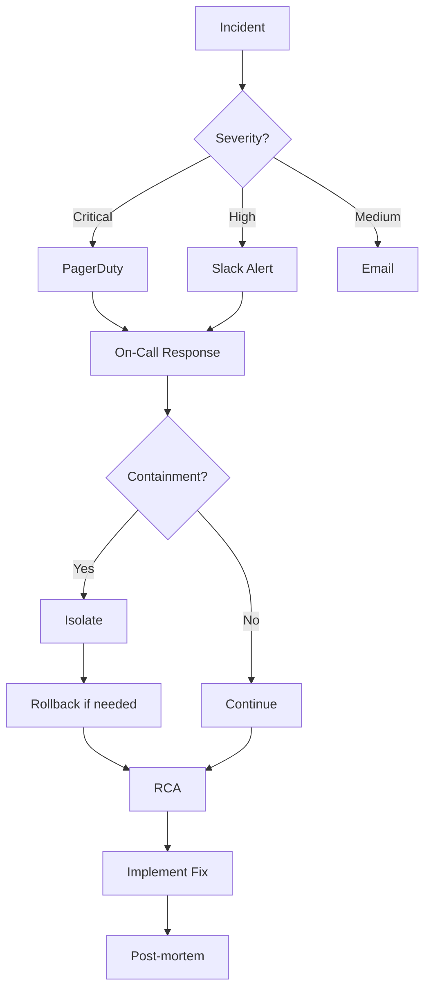

# My Evo 协作流程图 v2.0

> **版本**: 2.0 | **更新日期**: 2026-04-28

---

## 5. Swarm 多智能体协作流程

---

## 6. 前端状态管理

---

## 7. 部署架构

---

## 8. 安全架构

---

## 9. 故障处理流程

---

*文档版本: v2.0 | 最后更新: 2026-04-28*
